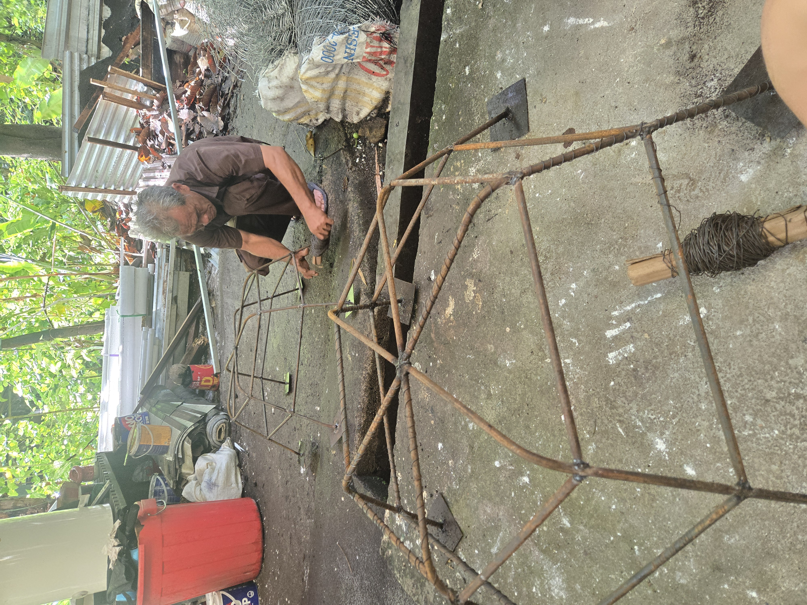
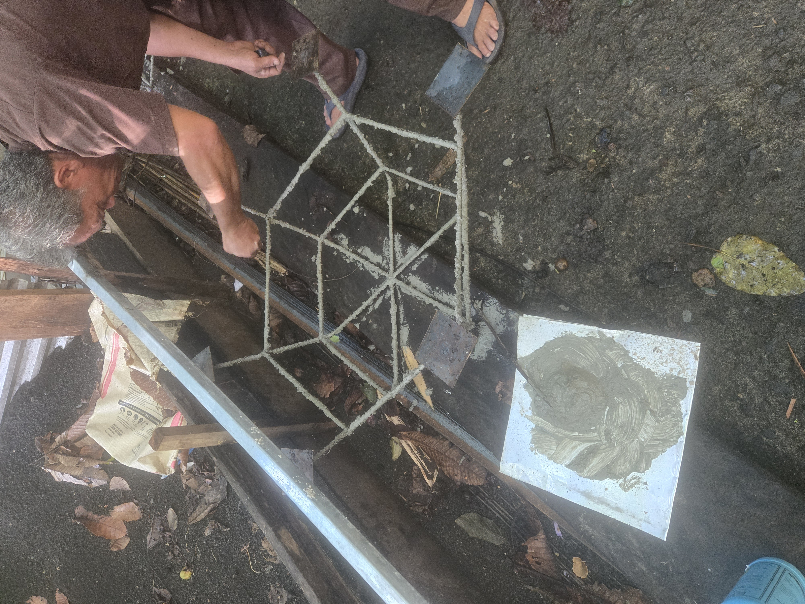
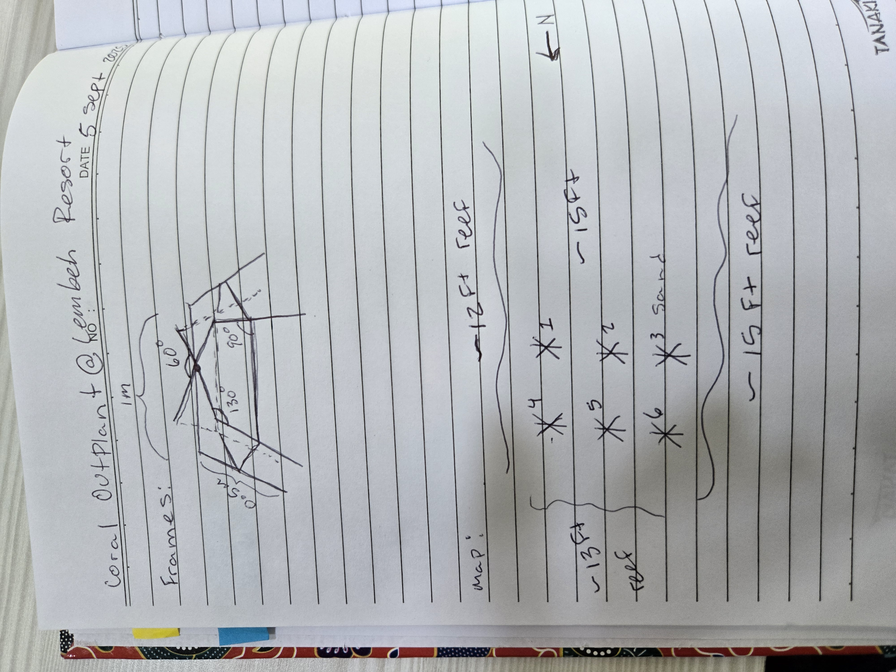

# Outplanting Lembeh Resort House Reef

**Discover whether concrete or rebar is a better substrate for coral outplantation structures in Lembeh**   

## Materials and Equipment  
- Rebar 
- Galvanized steel Wire
- Concrete (What kind was used?)

## Study Species (Not 100% sure on species ID, but sure of Genus)
- Acropora intermedia 
- Pocillopora vericusa

## Protocol Steps

#### Coral Spider Creation
- Cut a piece of Rebar into approximately 2m length, then bend so that there is a 0.5m leg, a 1m center, and another 0.5m leg. the angle should be about 110 degree angle.
- Repeat this 3 times, then overlap the three frames in the center so that they are all at approximately equal angles to one another (abnout 60 degree angle). Weld these together.
- Take a small piece of rebar that will fit between the legs about 1/2 way down the leg. Weld that into place for all 6 spaces. 
- Weld small squares of sheet metal to the bottom of each leg to act as feet and disperse the weight of the spiders. 
- Wrap the entire frame in 1/8 inch galvanized steel wire to crete a more textured surface. This will hopefully help corals grab onto frames better, but will also create a structure to support the concrete for a few of the frames. 

- Create a (not sure what kind of concrete) concrete mixture (no sand) and coated three of the frames in about 1/2 inch to 1 inch of concrete mixture. Let this dry in between layers if needed to accomplish the desired thickness.

- See image below for dimensions and drawing.

#### Coral Spider Placement
- Utilizing Lembeh Resort vessels, we placed dried frames on the boat, drove out to the desired location on the house reef, and handed the frames over the side of the boat. 
- We used BCDs to compensate for weight, and slowly eased frams to the bottom
- Scraps of underwater paper were labeled with numbers 1-6 and were attached to frames using zipe ties. 
- See image below  for map.

#### Coral selection and Outplantation
- Coral colonies were identified by each of two teams (team Acropora and team Pocillopora). Roving house reef surveys were used to identify colonies.
- One colony of each species were selected per frame (6 colonies of each species), and were photographed ahead of collection. Colonies were targeted for their size, ensuring they were large enough that 10 fragments would amount to less than 10% of the colony's total size.
- Fragements were broguht back to frames and attached using cable ties, being sure to pull ties tight enough that they crushed the polyps underneath the tie. This would ensure faster overgrowth of the tie.
- Ten (10) fragments of each species were placed on each frame (total n=20) such that Acropora took up 1/2 of each frame, and Pocillopora took up the other 1/2
- Recent work by the RRAP project out of AIMS suggests frames of this nature should have no more than 18 fragments on it for maximum success. These Spiders were made before we knew this, and thus host 20 fragments each.
- At the end of the outplantation, Pocillopora had a greater overall number of branches, as well as wider variability in branch number, wehreas Acropora fragments thad lower and more uniform number of branches. The same was true of TLE at timepoint 0.

## Initial Timepoint Data Collection
Data was  (or will be) collected at TP 0, 1 month, 2 months, 3 months, 4 months, and 6 month. At the time of this document, time 0 and 1 month have been recorded. I recommend that monitoring continue bi-annually for at least 2 years, as recent studies suggest ourplant success is not stable at 1 year post-outplant as has been previously assumed. 

#### Total Linear Extension and Branch counts
- Total Linear Extension was measured using a ruler and marked for each individual on each frame. This included a measurement of the total length of each branch from the midpoint at which it connected to the main branch, out to its apical point. 
- Number of branches on each fragment was counted to determine the amount 

#### Health determination and fate tracking
- At sampling intervals, corals from each frame and each species are categorized into healthy, bleached, diseased, or dead. This will result in fate tracking data.

